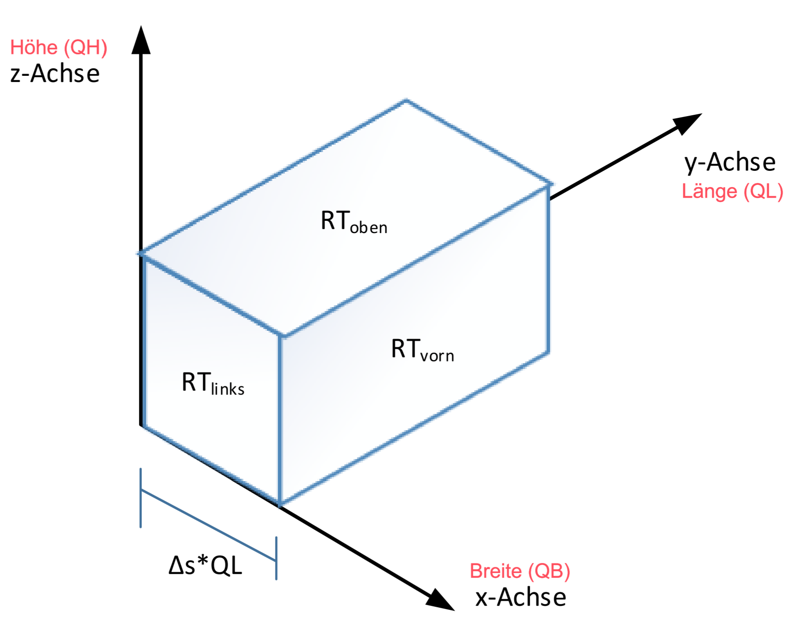

# pvr-waermesimulierung

Die Anwendung ist unter dieser Adresse verfügbar: http://stud-fb09-560/ (Eine Verbindung in das FH-Netz ist
erforderlich).

## Skizze



## Auflösung einer dreifach verschachtelten Schleife

```java
class Example {
    public static void main(String[] args) {
        int X = 3;
        int Y = 3;
        int Z = 3;
        Integer[][][] cube = new Integer[X][Y][Z];

        for (int i = 0; i < X * Y * Z; i++) {
            int x = i / (Y * Z);
            int y = (i / Z) % Y;
            int z = i % Z;
            System.out.println(i + " " + x + " " + y + " " + z);
            cube[x][y][z] = i;
        }
    }
}
```